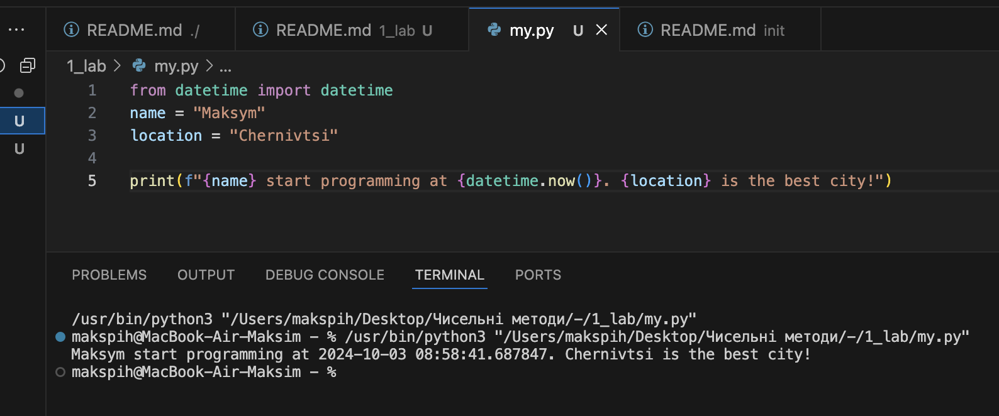
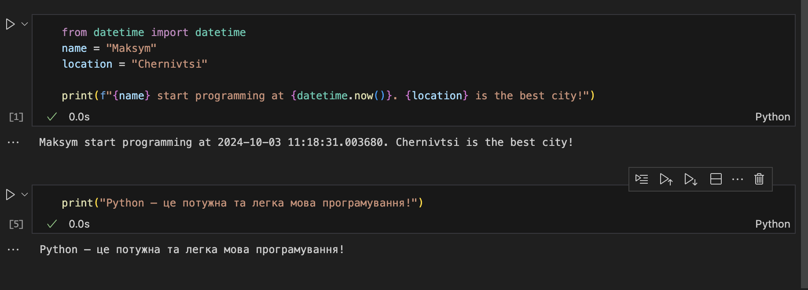
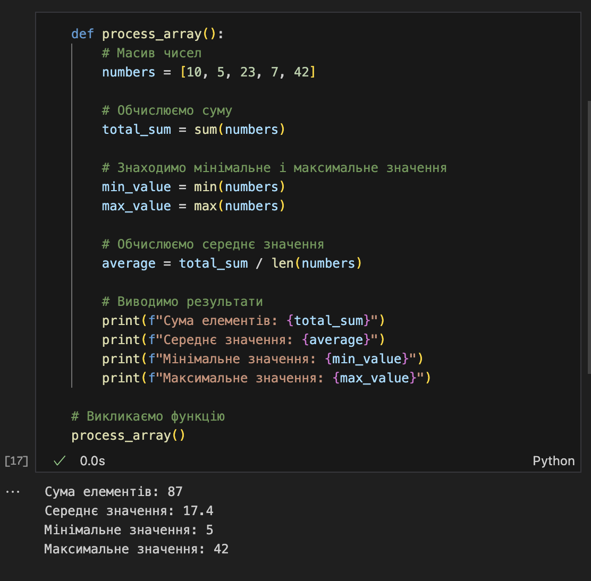

# Звіт до роботи 1
## Тема: Оформлення робіт та перша програма
### Мета роботи: налаштувати середовище, створити репозиторій, попрацювати з Markdown та оформити звіт

---
### Виконання роботи
* Результати виконання завдань:
    1. Створив репозиторій, [посилання на нього](https://github.com/MaksPih/KN41_nm);
    1. Навчився працювати з репозиторієм та налаштував інтеграцію з Visual Studio Code;
    1. Написав першу програму та запустили її. Програма вивела текст представлений на скріншоті:
    
    1. Створив Пайтон Ноутбук та виконав тестову програму в ньому. Програма надрукувала те що представлено на скріншоті:
    
    1. Навчились працювати з Пайтоном, запускати програми та оформлювати звіти;

* Результат що нам видав ChatGPT:

---
### Висновок:

- Створив репозиторій, навчився з ним працювати та написав першу програму.
- Так, було досягнуто мету: налаштувати середовище, створити репозиторій, попрацювати з Markdown та оформити звіт.
- Нові знання: як створювати та оформляти репозиторій, як працювати з форматуванням Markdown.
- На даний момент додаткових питань не виникло.
- Так, вдалося виконати всі завдання.
- В принципі все було зрозуміло.
- Так, все супер.

---